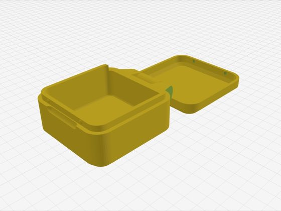
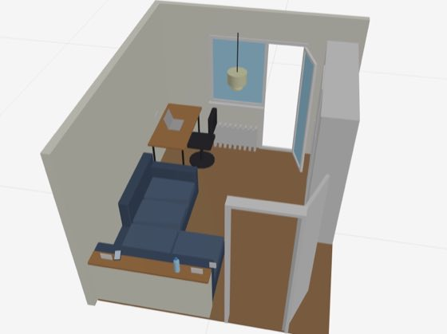
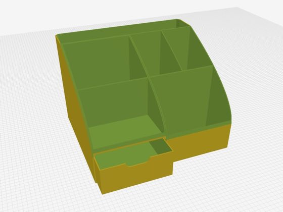

# ModelRift OpenSCAD skill

An agent skill for creating, rendering, inspecting, and revising OpenSCAD models. It gives coding agents a repeatable visual QA loop, versioned output conventions, cross-section tools, STL revision diffs, and compact reference parts for common printable mechanisms.

## Why OpenSCAD works well with LLMs

OpenSCAD is closer to a domain-specific language for geometry than GUI modeling tools such as FreeCAD or Blender. A model is text: primitives, transforms, boolean operations, modules, and parameters. That makes it a good target for an LLM. The agent can edit a file, render it, inspect the result, and make another revision without manipulating hidden scene state.

FreeCAD and Blender both have MCP integrations, but their larger, stateful interfaces are still harder for LLMs to handle reliably than OpenSCAD's code-and-render loop.

The hard part is judging the geometry.

Modern LLMs still have limited spatial understanding. They can inspect render images, but often miss details a human notices immediately: an awkward chamfer, an uneven wall, a collision hidden behind another part, a weak hinge, or a clearance that will not print. A clean isometric render can also hide problems that become obvious in a section view or after measuring the part.

## What this skill is good at

| ✅ Good fit | ❌ Poor fit |
| --- | --- |
| Small to moderately complex engineering parts with exact dimensions, angles, holes, walls, and clearances | Sculpted, organic, anatomical, or decorative freeform models |
| Brackets, adapters, mounts, boxes, enclosures, organizers, and spacers | Complex assemblies with many interacting or moving parts |

## Best practices

For anything intended to be useful, keep a human in the loop. A plausible render can still hide collisions, bad clearances, or a mechanism that cannot move through its full range. The reviewer should check the dimensions and intended function, not just whether the model looks convincing.

Start with a dimensioned sketch when possible. A quick drawing on paper with the important measurements, or a clear reference image, usually gives the agent more useful information than a long text description.

When something is wrong, mark it directly on the screenshot. Circle the problem, draw an arrow to the exact feature, and add a short note or target dimension. This gives the model a clear answer to what needs changing and where.

## What the skill includes

- A render, inspect, revise loop with standard isometric and orthographic cameras
- Immutable version naming for shared `.scad`, `.stl`, `.3mf`, and preview files
- 2D projections and section views for checking profiles and clearances
- A color-coded STL diff renderer: red is added material, blue is removed material, and gray is unchanged volume
- OpenSCAD Customizer conventions
- Multi-object 3MF export with lazy union
- Dependency-free reference parts for mating threads and print-in-place hinges

The main instructions are in [`SKILL.md`](SKILL.md). The STL comparison tool is [`scripts/stl_diff.py`](scripts/stl_diff.py).

## Built with ModelRift

<table>
  <tr>
    <td width="50%">
      <a href="https://modelrift.com/models/neat-clamshell-box-print-in-place-customizable"></a><br />
      <a href="https://modelrift.com/models/neat-clamshell-box-print-in-place-customizable">Neat clamshell box. Print-in-place, customizable</a>
    </td>
    <td width="50%">
      <a href="https://modelrift.com/models/eiffel-tower"></a><br />
      <a href="https://modelrift.com/models/eiffel-tower">Eiffel Tower</a>
    </td>
  </tr>
  <tr>
    <td width="50%">
      <a href="https://modelrift.com/models/interior-layout"></a><br />
      <a href="https://modelrift.com/models/interior-layout">Room interior layout via AI</a>
    </td>
    <td width="50%">
      <a href="https://modelrift.com/models/desktop-organizer-with-drawer"></a><br />
      <a href="https://modelrift.com/models/desktop-organizer-with-drawer">Desktop Organizer with Drawer</a>
    </td>
  </tr>
</table>

## Small reference parts instead of a large CAD library

Threads and hinges are useful enough to deserve concrete examples, but they are also easy for an agent to get almost right. A plausible render does not prove that threads will mate or that a hinge can move without fused or intersecting parts.

The skill therefore includes two small, standalone OpenSCAD models:

- [`threaded-connector.scad`](assets/reference-parts/threaded-connector.scad) contains mating male and female helical threads with an explicit fit clearance.
- [`print-in-place-hinge.scad`](assets/reference-parts/print-in-place-hinge.scad) contains a five-segment hinge with a continuous faceted pin and printable radial clearance.

Each example has a compact PNG beside it, compiles without external libraries, and is intended to be tested unchanged before the relevant modules are adapted. The hinge is collision-checked at 0, 45, 90, and 180 degrees. The thread pair is boolean-checked to ensure the male solid does not intersect the female body at the configured clearance. These checks establish a useful starting point, not a guarantee for a particular printer or material; print a fit coupon before committing to a large part.

## Recommended agent setup

Our current recommendation is the Antigravity 2.0 coding agent with Flash 3.7+ at medium reasoning. In our tests, this setup has been unusually good at reading renders and reasoning about spatial changes. On this particular OpenSCAD loop, it has often produced better results than the latest OpenAI and Anthropic models.

The [ModelRift OpenSCAD LLM benchmark](https://modelrift.com/blog/openscad-llm-benchmark/) shows why the render and inspection loop matters. In that Pantheon test, Antigravity 2.0 with Gemini 3.5 Flash High produced the best autonomous result. A separate human-guided ModelRift (with Flash 3.0) run improved on the original autonomous batch by letting the user attach visual feedback to the render. The benchmark predates the Flash 3.7+ recommendation above, so treat it as evidence for the workflow rather than a direct comparison of current models.

This recommendation will age as models change. Whichever agent you use, give it access to the OpenSCAD CLI and an image-viewing tool, and keep a human involved in the review loop.

## Requirements

- Git
- An OpenSCAD `2026.x` development snapshot or newer, available as `openscad` on `PATH`
- Python 3 for the STL diff script

The official [GitHub Releases page](https://github.com/openscad/openscad/releases) is the stable-release history; legacy builds such as `2021.01` are too old for this workflow. Install a current build from the official [Development Snapshots section](https://openscad.org/downloads.html#snapshots). On macOS, the official download page also lists:

```bash
brew install openscad@snapshot
```

Confirm the local tools before starting:

```bash
openscad --version
openscad --help 2>&1 | rg -- '--backend|lazy-union'
python3 --version
```

The version output must report a `2026.x` development snapshot or newer, and the help output must list the `Manifold` backend and `lazy-union`. If the shell reports `2025.x` or older after installing a snapshot, fix `PATH` so it resolves the new executable before using the skill.

## Install

The simplest installation method is to give your coding agent this instruction:

```text
Go to https://github.com/ModelRift/openscad-skill/ and install the skill.
```

A capable agent can inspect the repository, find its own skill directory, clone the complete package, and verify that `SKILL.md` is discoverable. The manual commands below are available if you prefer to install it yourself.

### Antigravity 2.0

Antigravity discovers global skills under `~/.gemini/config/skills/`. Clone the repository there:

```bash
mkdir -p ~/.gemini/config/skills
git clone https://github.com/ModelRift/openscad-skill.git \
  ~/.gemini/config/skills/modelrift-openscad
```

Start a new conversation after installation. If the skill does not appear, restart Antigravity. The official [Antigravity skill documentation](https://antigravity.google/docs/skills) also describes workspace-scoped installation.

To install the skill for one project instead, run this from the project root:

```bash
mkdir -p .agents/skills
git clone https://github.com/ModelRift/openscad-skill.git \
  .agents/skills/modelrift-openscad
```

### Codex

Codex discovers personal skills under `~/.agents/skills/`:

```bash
mkdir -p ~/.agents/skills
git clone https://github.com/ModelRift/openscad-skill.git \
  ~/.agents/skills/modelrift-openscad
```

For a repository-scoped installation, clone it into `.agents/skills/modelrift-openscad` at the repository root. Codex normally detects skill changes automatically. Restart it if the skill does not appear. See the official [Codex skill documentation](https://developers.openai.com/codex/skills) for discovery rules and invocation details.

### Another compatible agent

Clone the complete repository into the agent's skill directory. Keep the repository structure intact because the root skill links to reference parts, preview images, and scripts by relative path. If the agent does not have automatic skill discovery, point it directly to `SKILL.md`.

## Update

Use the path from your installation:

```bash
git -C ~/.gemini/config/skills/modelrift-openscad pull --ff-only
```

For Codex, use `~/.agents/skills/modelrift-openscad`.

If you installed an earlier version under an `openscad` folder, rename it once so it matches the new skill identifier. Use the command for your agent:

```bash
# Antigravity
mv ~/.gemini/config/skills/openscad \
  ~/.gemini/config/skills/modelrift-openscad

# Codex
mv ~/.agents/skills/openscad \
  ~/.agents/skills/modelrift-openscad
```

Then use the new path for future updates.

## Use the skill

The agent can activate the skill automatically when a task involves OpenSCAD rendering, debugging, export, threads, or hinges. You can also name it explicitly:

```text
Use modelrift-openscad to build a parametric wall bracket. Render and inspect it before showing me the final version.
```

```text
Use modelrift-openscad and its bundled threaded connector reference to add printable internal and external threads. Make a small fit coupon first.
```

```text
Compare output/out.v03.stl with output/out.v04.stl and render isometric and top STL diff images.
```

## When the skill needs more visual feedback

The agent's render is a draft review, not proof that the part is correct. Check dimensions, section cuts, clearances, wall thickness, moving joints, and the exported mesh yourself.

For closer visual inspection, [ModelRift](https://modelrift.com) is a browser-based OpenSCAD IDE that keeps the code and model together. Its tools include point-to-point measurement and section cuts, so a person can give the LLM specific feedback instead of saying only "the shape looks wrong."

The ModelRift editor and this skill are separate projects. Neither requires the other. They use a similar loop: generate OpenSCAD, render it, inspect the result, and revise the code.
